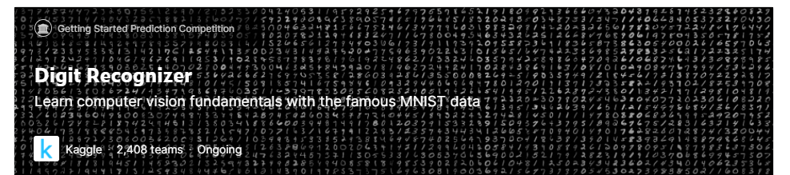
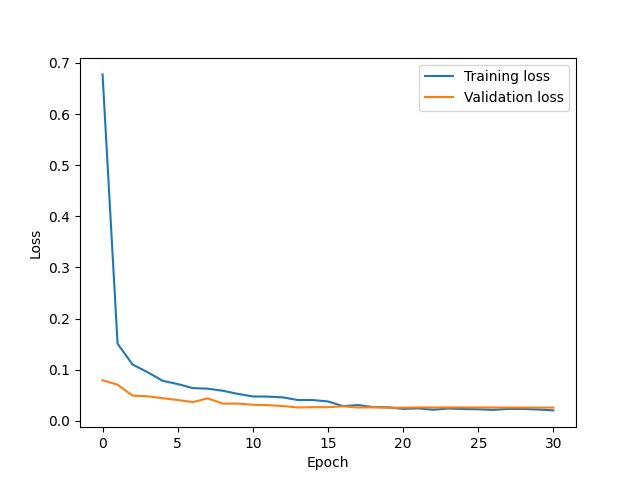
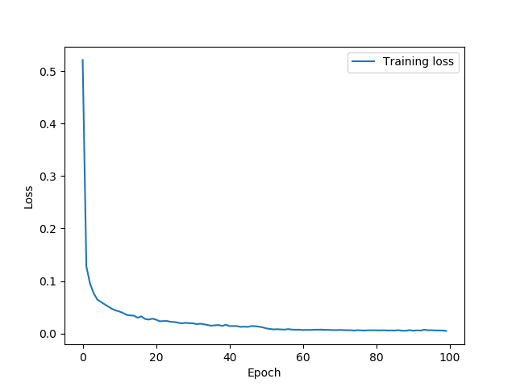
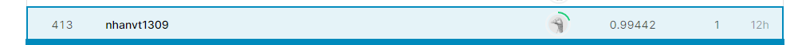

# Digit Recognizer Using CNN Model
This repository contains the code for solution of [digit
recognition](https://www.kaggle.com/c/digit-recognizer) problem on [Kaggle
challenge](https://www.kaggle.com/). Particularly, convolutional neural network
(CNN) model was used, along with regularization techniques such as: Dropout,
Weight decay, Early Stopping.
## Usage
Follow below instructions for running three steps: train - val - test on MNIST dataset:

1. Download dataset from **Data** tab on challenge page, unzip it to repository
   folder.

2. Run `python split_trainval.py -s train.csv -d data_main -r 0.2` to split
    original training set up train and validation set for finetune.

3. Run `python train.py -c cfg/train_config_1.json` to train model with default
   setting. After training, checkpoints and logs in this process are saved in
   folders `saved/models/run_id` and `saved/logs/run_id` respectively. Note
   that `run_id` is automatically generated when running instructions and it
   is unique.

4. Run `python eval.py -c cfg/train_config_1.json` to validate trained model
   on validation set. The prediction can be saved in `saved/models/run_id` if
   you config it on `cfg/train_config_1.json`.

5. Copy file `test.csv` to `data_main` and run `python test.py -c cfg/train_config_1.json` to inference on test set. The prediction is saved in `saved/models/run_id`

## Supports
### Resuming from checkpoints
You can resume from saved checkpoint by adding `resume_path` in `trainer` of
`cfg/train_config_1.json`, namely:
```
...
"trainer":{
    "resume_path": "saved/models/1012_023002/checkpoint-epoch100.pth"",
    "save_dir": "saved",
    "device": "GPU",
    "log_step": 50,
    "do_validation": true,
    "validation_step": 1,
    "epochs": 100,
    "tracked_metric": ["val_neg_log_llhood", "min"],
    "patience": 10,
    "save_period": 1,
    "save_result": false,
    "track4plot": true
},
...
```
### Configuring data loader, optimizer, learning rate scheduler
You also can configure some hyper-parameters of `loader`, `optimizer` and
`lr_scheduler` easily from `cfg/train_config_1.json`, namely:
```
...
"train_data_loader":{
    "name": "MNIST training dataloader",
    "args": {
        "root": "data_main",
        "csv_file": "train.csv",
        "batch_size": 64,
        "shuffle": true, 
        "num_workers": 0
    }
},
"optimizer":{
    "name": "SGD",
    "args":{
        "lr": 0.01,
        "weight_decay": 1e-04
    }   
},
"lr_scheduler":{
    "name": "ReduceLROnPlateau",
    "args":{
        "mode": "min",
        "threshold": 0.01,
        "factor": 0.5,
        "patience": 1,
        "verbose": true,
        "min_lr": 1e-05,
        "threshold_mode": "rel"
    }
},
...
```
### Train loss plotting
Train and validation can be plotted by run this code:
```
from utils import plot_train_val_loss
# log file of train and val loss saved in saved/logs/run_id
log_file = 'log_loss.txt'
# output image file
out_file = 'log_loss.png' 
plot_train_val_loss(log_file, out_file)
```
### Calculate other metrics for classification problem
`Accuracy` is used by default when evaluating model. Besides, `precision`,
`recall` and `F1-score` are also supported according to `OneVsRest` mechanism:
```
from MNIST_evaluate import precision_recall
# Prediction file saved is saved/models/run_id
prediction_file = 'result.csv'
# Directory contains output file
output_dir = 'output'
precision_recall(prediction_file, output_dir)
```
## Results
In my experiments, I trained two models on split training data (20% for
validation) and all
training data respectively. I used **P100** GPU on `Colab` for training and
achieved the following results:
### Split training set

#### Metrics
| Class | Precision | Recall  | F1-score |
| ------ | --------- | ----------- | ---------- |
|0	|0.987	|0.998	|0.992
|1	|0.990	|0.996	|0.993
|2	|0.974	|0.994	|0.984
|3	|0.988	|0.986	|0.987
|4	|0.978	|0.994	|0.986
|5	|0.993	|0.981	|0.987
|6	|0.986	|0.990	|0.988
|7	|0.992	|0.990	|0.991
|8	|0.994	|0.969	|0.981
|9	|0.987	|0.968	|0.977

**Accuracy** and **CE** loss on validation set are **99.28**% and **0.026**
respectively.
### All training set
I trained a model on all training set and submited result to evaluation system of
**Kaggle** for this challenge.

#### My submission result



